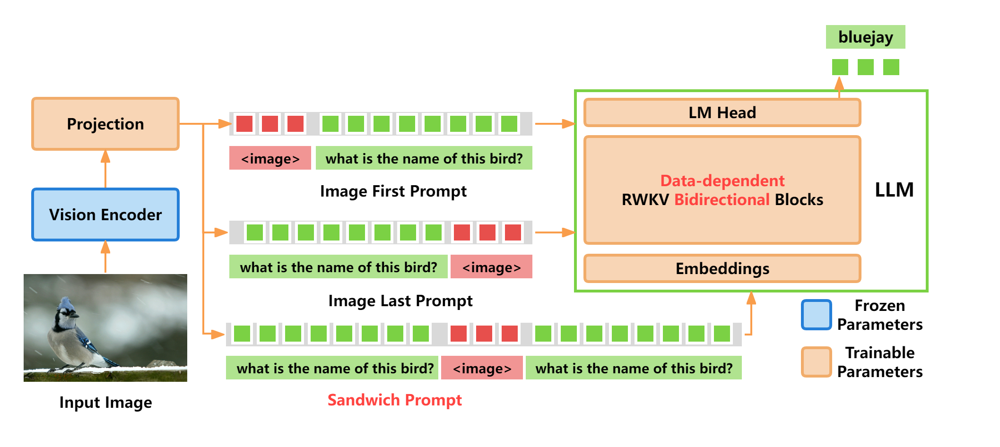

# VELA: Visual Early-fusion Language-model for Action

<p align="center">
  
</p>

VELA extends the RWKV language model with early visual fusion and action output, enabling a single recurrent model to perceive, reason, and act across embodied tasks.

> ⚠️ **DISCLAIMER 1:** This repository is a learning project made by a single Brazilian student that is exploring the design space of RWKV-based vision backbones. The architecture started as a port from VisualRWKV-7 to use Attention Residuals and slowly transition it to a Vision Language Action Model (VLA), but I am not restricted to that and I might explore multiple design paths.

> ⚠️ **DISCLAIMER 2:** All the ideas behind what to do for this architecture are mine, but AI is still used in this project, mainly for those distinct tasks: commit message writing and automatic commit splitting, batch code writing for repetitive chores and helper routines. Parts of this README may be written by AI too as I usually ask it to compile information from the results of tests that I do.

## Description

VELA is a visual language model built on [RWKV-7](https://github.com/BlinkDL/RWKV-LM), a recurrent neural network architecture with linear-complexity inference. Unlike conventional vision-language models that use cross-attention between a vision encoder and a language decoder, VELA fuses visual tokens directly into the RWKV embedding space before the recurrent stack processes the sequence. This early visual fusion lets the RWKV's recurrent state jointly encode vision and language context from step one.

The architecture combines a multi-scale vision backbone (SAM, DINOv2, SigLIP) with an RWKV-7 language model, and (in v7.10+) adds action output heads that extend the model from visual perception and reasoning to closed-loop control for embodied AI tasks.

## Key Features

- **Multi-Scale Vision Backbone**: Combines SAM (1024px), DINOv2 (448px), and **SigLino** (from tiiuae/siglino) features for rich, multi-scale visual representations. SigLino is locally vendored and uses custom optimized kernels (compiled SDPA on CPU, flex_attention on CUDA).
- **Weight Quantization**: Integrates optional **torchao** weight quantization support (CUDA int4 weight-only and CPU int8 weight-only) for efficient low-memory footprint.
- **Early Visual Fusion**: Visual tokens are injected at the embedding layer before the RWKV recurrence, enabling unified vision-language state from the first step.
- **Linear-Time Inference**: Inherits RWKV's O(n) time complexity and O(1) memory — no quadratic attention bottleneck.
- **Block Attention Residuals**: Replaces standard additive residual connections with **Block AttnRes**, which partitions layers into chunks and uses a learned, input-dependent cross-layer attention mechanism to selectively aggregate previous representations, solving the PreNorm hidden-state dilution problem.
- **Multi-Resolution Support**: Dynamic tile splitting processes images at multiple aspect ratios (1:1, 1:2, 2:1, 1:3, 3:1).
- **Action Output (v7.10+)**: Extends the unified recurrent model from perception and reasoning to action prediction for embodied AI tasks.
- **Distributed Training**: Built on PyTorch Lightning with DeepSpeed ZeRO for multi-GPU training across model scales.
- **CUDA-Optimized WKV Kernel**: Custom WindBackstepping CUDA kernel for efficient RWKV-7 recurrence on GPU.

## Project Structure

```
VELA/
├── README.md                    # This file
├── pyproject.toml               # Project configuration
├── LICENSE                      # Apache 2.0
├── VELA-arch.png                # Architecture diagram
├── rwkv_emoji.png               # Logo
├── VELA-v7/                     # VELA models based on RWKV-7
│   ├── src/
│   │   ├── model.py             # VELA and RWKV model definitions
│   │   ├── dataset.py           # Multi-modal dataset and tokenization
│   │   ├── trainer.py           # Training loop and LR schedule callbacks
│   │   └── utils.py             # Utility functions
│   ├── app/                     # Inference demo / serving app
│   ├── eval/                    # Benchmark evaluation tools (including PCA visualization)
│   ├── train.py                 # Training entry point
│   └── evaluate.py              # Local evaluation entry point
├── cuda/                        # CUDA kernels (wkv7)
│   ├── wkv7_cuda.cu
│   └── wkv7_op.cpp
└── download_huggingface.py      # HuggingFace model download
```

## Installation

Requires Python ≥ 3.11 and PyTorch.

```bash
# Clone repository
git clone https://github.com/your-org/VELA.git
cd VELA

# Install with uv (recommended)
uv sync

# Or with pip
pip install -e .
```

## PCA Feature Visualization

To visualize the patch features learned by the SigLino vision encoder compared to SigLIP2 and DINOv3, you can use the PCA visualization tool:

```bash
# Run on CPU with a HuggingFace hub model (with optional torchao int8 CPU weight-only quantization)
python VELA-v7/eval/pca_vis.py \
  --hub_repo tiiuae/siglino-30M \
  --config_name dense-30M \
  --device cpu \
  --quantize \
  --input_dir VELA-v7/dummy_data/images/textvqa/train_images \
  --output_path VELA-v7/eval/pca_out \
  --num_samples 5 \
  --max_num_patches 1024

# Run on CUDA (with optional torchao int4 weight quantization)
python VELA-v7/eval/pca_vis.py \
  --hub_repo tiiuae/siglino-0.6B \
  --config_name dense-0.6B \
  --device cuda \
  --quantize \
  --input_dir /path/to/images \
  --output_path /path/to/output \
  --num_samples 10 \
  --max_num_patches 1024
```

## References

- **RWKV-7 "Goose"**: Peng, B., Alcaide, E., et al. "RWKV-7 'Goose' with Expressive Dynamic State Evolution." _arXiv:2503.14456_ (2025).
- **VELA: Exploring RNNs for Visual Language Models**: Hou, H., et al. _arXiv:2406.13362_ (2024).
- **SAM**: Kirillov, A., et al. "Segment Anything." _ICCV 2023_.
- **DINOv2**: Oquab, M., et al. "DINOv2: Learning Robust Visual Features without Supervision." _arXiv:2304.07193_ (2023).
- **SigLIP**: Zhai, X., et al. "Sigmoid Loss for Language Image Pre-Training." _ICCV 2023_.

## License

Apache 2.0. See [LICENSE](LICENSE) for details.
